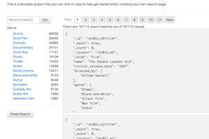
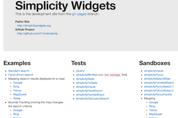

  
  

    <h4 class="media-heading">simplicity-template-example</h4>
    

      A template that you can use to get a quick start in creating your own search page.
    

    

      <a href="http://t11e.github.com/simplicity-template-example" class="btn">View Example</a>
      <a href="http://github.com/t11e/simplicity-template-example" class="btn">Source Repository</a>
    

  

  
  

    <h4 class="media-heading">simplicity</h4>
    

      The Simplicity source repository contains some example search pages.
    

    

      <a href="http://t11e.github.com/simplicity" class="btn">View Example</a>
      <a href="http://github.com/t11e/simplicity" class="btn">Source Repository</a>
    

  

