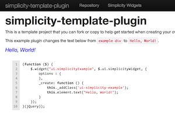
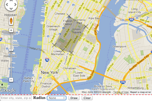

  
  

    <h4 class="media-heading">simplicity-template-plugin</h4>
    

      A template that you can use to get a quick start in creating your own widgets.
    

    

      <a href="http://t11e.github.com/simplicity-template-plugin" class="btn">View Example</a>
      <a href="http://github.com/t11e/simplicity-template-plugin" class="btn">Source Repository</a>
    

  

  
  

    <h4 class="media-heading">simplicity-plugin-map-shape-creator</h4>
    

      Provides a polygon drawing tool and geocode point and radius search interface bound to a
      map. Supports Google, Bing, Nokia and MapQuest maps.
    

    

      <a href="http://t11e.github.com/simplicity-plugin-map-shape-creator" class="btn">View Example</a>
      <a href="http://github.com/t11e/simplicity-plugin-map-shape-creator" class="btn">Source Repository</a>
    

  

